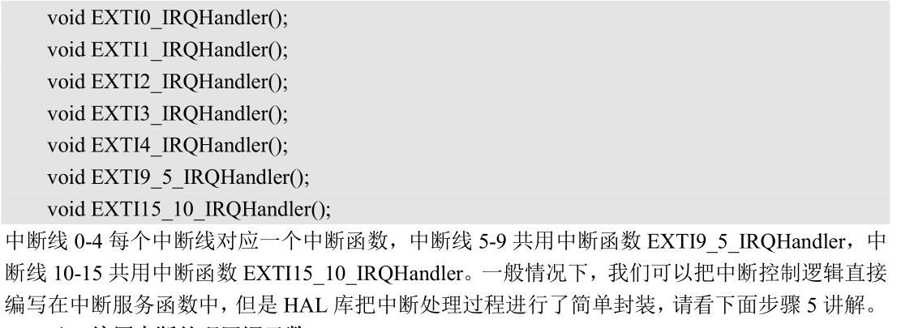

<font face = "楷体">

# 代码收集

---

# 一、跑马灯

---

```C
void LED_Init(void)
{
    GPIO_InitTypeDef GPIO_Initure;
    __HAL_RCC_GPIOB_CLK_ENABLE(); //开启 GPIOB 时钟
    GPIO_Initure.Pin=GPIO_PIN_0|GPIO_PIN_1; //PB1,0
    GPIO_Initure.Mode=GPIO_MODE_OUTPUT_PP; //推挽输出
    GPIO_Initure.Pull=GPIO_PULLUP; //上拉
    GPIO_Initure.Speed=GPIO_SPEED_HIGH; //高速
    HAL_GPIO_Init(GPIOB,&GPIO_Initure);
    HAL_GPIO_WritePin(GPIOB,GPIO_PIN_0,GPIO_PIN_SET); //PB0 置 1 ，默认灯灭
    HAL_GPIO_WritePin(GPIOB,GPIO_PIN_1,GPIO_PIN_SET); //PB1 置 1 ，默认灯灭
}
#ifndef _LED_H
#define _LED_H
#include "sys.h"
//LED 端口定义
#define LED0(n) (n?HAL_GPIO_WritePin(GPIOB,GPIO_PIN_1,GPIO_PIN_SET):\
HAL_GPIO_WritePin(GPIOB,GPIO_PIN_1,GPIO_PIN_RESET))
#define LED0_Toggle (HAL_GPIO_TogglePin(GPIOB, GPIO_PIN_1))
#define LED1(n) (n?HAL_GPIO_WritePin(GPIOB,GPIO_PIN_0,GPIO_PIN_SET):\
HAL_GPIO_WritePin(GPIOB,GPIO_PIN_0,GPIO_PIN_RESET))
#define LED1_Toggle (HAL_GPIO_TogglePin(GPIOB, GPIO_PIN_0))
void LED_Init(void);
#endif
```

---

# 二、按键处理函数

---

```C
#include "key.h"
#include "delay.h"
//按键初始化函数
void KEY_Init(void)
{
    GPIO_InitTypeDef GPIO_Initure;
    __HAL_RCC_GPIOA_CLK_ENABLE(); //开启 GPIOA 时钟
    __HAL_RCC_GPIOC_CLK_ENABLE(); //开启 GPIOC 时钟
    __HAL_RCC_GPIOH_CLK_ENABLE(); //开启 GPIOH 时钟
    GPIO_Initure.Pin=GPIO_PIN_0; //PA0
    GPIO_Initure.Mode=GPIO_MODE_INPUT; //输入
    GPIO_Initure.Pull=GPIO_PULLDOWN; //下拉
    GPIO_Initure.Speed=GPIO_SPEED_HIGH; //高速
    HAL_GPIO_Init(GPIOA,&GPIO_Initure);
    GPIO_Initure.Pin=GPIO_PIN_13; //PC13
    GPIO_Initure.Mode=GPIO_MODE_INPUT; //输入
    GPIO_Initure.Pull=GPIO_PULLUP; //上拉
    GPIO_Initure.Speed=GPIO_SPEED_HIGH; //高速
    HAL_GPIO_Init(GPIOC,&GPIO_Initure);
    GPIO_Initure.Pin=GPIO_PIN_2|GPIO_PIN_3; //PH2,3
    HAL_GPIO_Init(GPIOH,&GPIO_Initure);
}
//按键处理函数
//返回按键值
//mode:0,不支持连续按;1,支持连续按;
//0，没有任何按键按下 1，WKUP 按下 WK_UP
//注意此函数有响应优先级,KEY0>KEY1>KEY2>WK_UP!!
u8 KEY_Scan(u8 mode)
{
    static u8 key_up=1; //按键松开标志
    if(mode==1)key_up=1; //支持连按
    if(key_up&&(KEY0==0||KEY1==0||KEY2==0||WK_UP==1))
    {
        delay_ms(10);
        key_up=0;
        if(KEY0==0) return KEY0_PRES;
        else if(KEY1==0) return KEY1_PRES;
        else if(KEY2==0) return KEY2_PRES;
        else if(WK_UP==1) return WKUP_PRES;
        }else if(KEY0==1&&KEY1==1&&KEY2==1&&WK_UP==0)key_up=1;
        return 0; //无按键按下
}
#define KEY0 HAL_GPIO_ReadPin(GPIOH,GPIO_PIN_3) //KEY0 按键 PH3
#define KEY1 HAL_GPIO_ReadPin(GPIOH,GPIO_PIN_2) //KEY1 按键 PH2
#define KEY2 HAL_GPIO_ReadPin(GPIOC,GPIO_PIN_13) //KEY2 按键 PC13
#define WK_UP HAL_GPIO_ReadPin(GPIOA,GPIO_PIN_0) //WKUP 按键 PA0
```

---

# 三、 串口通信

---

## 1. 基本设置

1. 串口时钟使能。除了串口 1 和串口 6 的时钟使能在 APB2ENR 寄存器，其他串口的时钟使能位都在 APB1ENR 寄存器
2. 串口波特率设置，一般情况下使用串口的基本功能，调用函数 HAL_UART_Init对串口进行初始化的时候，我们只需要先设置 Instance 和 Init 两个成员变量的值
3. 串口控制。STM32F767的每个串口都有3个控制寄存器USART_CR1~3，串口的很多配置都是通过这 3 个寄存器来设置的。
4.中断。 HAL 库定义了一个串口中断处理通用函数 `HAL_UART_IRQHandler`，该函数声明如下：
`void HAL_UART_IRQHandler(UART_HandleTypeDef *huart);`,真正的串口中断处理逻辑我们会最终在函数HAL_UART_IRQHandler内部执行。

## 2. 代码块

```C
void USART1_IRQHandler(void)
{
    HAL_UART_IRQHandler(&UART1_Handler); //调用 HAL 库中断处理公用函数
    …//中断处理完成后的结束工作
}
```

在我们后面很多实验，为了效率和处理逻辑方便，我们会选择将接收控制逻辑直接编写在中断服务函数内部。每当一个事件发生，就会最终
调用相应的回调函数，我们在回调函数中编写真正的控制逻辑即可
HAL 库一共提供了 5 个中断处理回调函数：

`void HAL_UART_TxCpltCallback(UART_HandleTypeDef *huart);`//发送完成回调函数
`void HAL_UART_TxHalfCpltCallback(UART_HandleTypeDef *huart);`//发送完成过
`void HAL_UART_RxCpltCallback(UART_HandleTypeDef *huart);`//接收完成回调函数
`void HAL_UART_RxHalfCpltCallback(UART_HandleTypeDef *huart);`//接收完成过半
`void HAL_UART_ErrorCallback(UART_HandleTypeDef *huart);`//错误处理回调函数

```C
//初始化 IO 串口 1 bound:波特率
void uart_init(u32 bound)
{
    //UART 初始化设置
    UART1_Handler.Instance=USART1; //USART1
    UART1_Handler.Init.BaudRate=bound; //波特率
    UART1_Handler.Init.WordLength=UART_WORDLENGTH_8B; //字长为 8 位格式
    UART1_Handler.Init.StopBits=UART_STOPBITS_1; //一个停止位
    UART1_Handler.Init.Parity=UART_PARITY_NONE; //无奇偶校验位
    UART1_Handler.Init.HwFlowCtl=UART_HWCONTROL_NONE; //无硬件流控
    UART1_Handler.Init.Mode=UART_MODE_TX_RX; //收发模式
    HAL_UART_Init(&UART1_Handler); //HAL_UART_Init()会使能 UART1
    HAL_UART_Receive_IT(&UART1_Handler, (u8 *)aRxBuffer, 1);
    //该函数会开启接收中断并且设置接收缓冲以及接收缓冲接收最大数据量
}
void HAL_UART_MspInit(UART_HandleTypeDef *huart)
{
    //GPIO 端口设置
    GPIO_InitTypeDef GPIO_Initure;
    if(huart->Instance==USART1) //如果是串口 1，进行串口 1 MSP 初始化
    {
        __HAL_RCC_GPIOA_CLK_ENABLE(); //使能 GPIOA 时钟
        __HAL_RCC_USART1_CLK_ENABLE(); //使能 USART1 时钟
        GPIO_Initure.Pin=GPIO_PIN_9; //PA9
        GPIO_Initure.Mode=GPIO_MODE_AF_PP; //复用推挽输出
        GPIO_Initure.Pull=GPIO_PULLUP; //上拉
        GPIO_Initure.Speed=GPIO_SPEED_FAST; //高速
        GPIO_Initure.Alternate=GPIO_AF7_USART1; //复用为 USART1
        HAL_GPIO_Init(GPIOA,&GPIO_Initure); //初始化 PA9
        GPIO_Initure.Pin=GPIO_PIN_10; //PA10
        HAL_GPIO_Init(GPIOA,&GPIO_Initure); //初始化 PA10
        #if EN_USART1_RX
        HAL_NVIC_EnableIRQ(USART1_IRQn); //使能 USART1 中断通道
        HAL_NVIC_SetPriority(USART1_IRQn,3,3); //抢占优先级 3，子优先级 3
        #endif
    }
}
```

---

# 四、 外部中断

---

## 1. 基础设置

1. 使能 IO 口时钟。
2. 设置IO 口模式，触发条件开启 SYSCFG 时钟，设置 IO口与中断线的映射关系。
    >`GPIO_Initure.Mode=GPIO_MODE_IT_RISING; //外部中断，上升沿触发`
3. 配置中断优先级（NVIC），并使能中断。
    >`HAL_NVIC_SetPriority(EXTI0_IRQn,2,1); //抢占优先级为 2，子优先级为 1`
    >`HAL_NVIC_EnableIRQ(EXTI0_IRQn); //使能中断线 2`
4. 编写中断服务函数
5. 编写中断处理数回调函数 `HAL_GPIO_EXTI_Callback`在使用 HAL 库的时候，我们也可以跟使用标准库一样，在中断服务函数中编写控制逻辑。但是HAL库为了用户使用方便，它提供了一个中断通用入口函数`HAL_GPIO_EXTI_IRQHandler`，在该函数内部直接调用回调函数`HAL_GPIO_EXTI_Callback`。

## 2. 代码

略h

---

# 五、 定时器中断

---

## 1. 定时器介绍

1. 32位定时器只包括T2和T5，其他都是16位TIM9~TIM14只支持向上（递增）计数方式
2. 如下事件发生时产生中断/DMA（TIM9~TIM14 不支持 DMA）：
    >A．更新：计数器向上溢出/向下溢出，计数器初始化(通过软件或者内部/外部触发)
    >B．触发事件(计数器启动、停止、初始化或者由内部/外部触发计数)
    >C．输入捕获
    >D．输出比较
    >E．支持针对定位的增量(正交)编码器和霍尔传感器电路（TIM9~TIM14 不支持）
    >F．触发输入作为外部时钟或者按周期的电流管理（TIM9~TIM14 不支持）

配置步骤

1. TIM3 时钟使能。
2. 初始化定时器参数, 设置自动重装值，分频系数在HAL库中，定时器的初始化参数是通过定时器初始化函数`HAL_TIM_Base_Init`实现的
3. 使能定时器更新中断，使能定时器。HAL库中，使能定时器更新中断和使能定时器两个操作可以在函数`HAL_TIM_Base_Start_IT()`中一次完成的
4. TIM3 中断优先级设置定时器初始化定义了回调函数 `HAL_TIM_Base_MspInit`。一般情况下，与 MCU 有关的时钟使能，以及中断优先级配置我们都会放在该回调函数内部。
5. 编写中断服务函数,定时器3的中断服务函数为：`TIM3_IRQHandler();`

## 2. 代码d

.C文件

```C
TIM_HandleTypeDef TIM3_Handler; //定时器句柄
//通用定时器 3 中断初始化
//arr：自动重装值。 psc：时钟预分频数
//定时器溢出时间计算方法:Tout=((arr+1)*(psc+1))/Ft us.
//Ft=定时器工作频率,单位:Mhz
//这里使用的是定时器 3!(定时器 3 挂在 APB1 上，时钟为 HCLK/2)
void TIM3_Init(u16 arr,u16 psc)
{
    TIM3_Handler.Instance=TIM3; //通用定时器 3
    TIM3_Handler.Init.Prescaler=psc; //分频系数
    TIM3_Handler.Init.CounterMode=TIM_COUNTERMODE_UP; //向上计数器
    TIM3_Handler.Init.Period=arr; //自动装载值
    TIM3_Handler.Init.ClockDivision=TIM_CLOCKDIVISION_DIV1; //时钟分频因子
    HAL_TIM_Base_Init(&TIM3_Handler); //初始化定时器 3
    HAL_TIM_Base_Start_IT(&TIM3_Handler); //使能定时器 3 和定时器 3 更新中断
}
//定时器底册驱动，开启时钟，设置中断优先级
//此函数会被 HAL_TIM_Base_Init()函数调用
void HAL_TIM_Base_MspInit(TIM_HandleTypeDef *htim)
{
    __HAL_RCC_TIM3_CLK_ENABLE(); //使能 TIM3 时钟
    HAL_NVIC_SetPriority(TIM3_IRQn,1,3); //设置中断优先级，抢占 1，子优先级 3
    HAL_NVIC_EnableIRQ(TIM3_IRQn); //开启 ITM3 中断
}
//定时器 3 中断服务函数
void TIM3_IRQHandler(void)
{
    HAL_TIM_IRQHandler(&TIM3_Handler);
}
//定时器 3 中断服务函数调用
void HAL_TIM_PeriodElapsedCallback(TIM_HandleTypeDef *htim)
{
    if(htim==(&TIM3_Handler))
    {
        LED1_Toggle; //LED0 反转
    }
}
```

---

# 六、 PWM波

---
.h文件

```C
TIM_HandleTypeDef TIM3_Handler; //定时器 3PWM 句柄
TIM_OC_InitTypeDef TIM3_CH4Handler; //定时器 3 通道 4 句柄
//PWM 输出初始化
//arr：自动重装值 psc：时钟预分频数
void TIM3_PWM_Init(u16 arr,u16 psc)
{
    TIM3_Handler.Instance=TIM3; //定时器 3
    TIM3_Handler.Init.Prescaler=psc; //定时器分频
    TIM3_Handler.Init.CounterMode=TIM_COUNTERMODE_UP;//向上计数模式
    TIM3_Handler.Init.Period=arr; //自动重装载值
    TIM3_Handler.Init.ClockDivision=TIM_CLOCKDIVISION_DIV1;
    HAL_TIM_PWM_Init(&TIM3_Handler); //初始化 PWM
    TIM3_CH4Handler.OCMode=TIM_OCMODE_PWM1; //模式选择 PWM1
    TIM3_CH4Handler.Pulse=arr/2; //设置比较值,此值用来确定占空比
    TIM3_CH4Handler.OCPolarity=TIM_OCPOLARITY_LOW; //输出比较极性为低
    HAL_TIM_PWM_ConfigChannel(&TIM3_Handler,&TIM3_CH4Handler,
    TIM_CHANNEL_4); //配置 TIM3 通道 4
    HAL_TIM_PWM_Start(&TIM3_Handler,TIM_CHANNEL_4);//开启 PWM 通道 4
}
//定时器底层驱动，时钟使能，引脚配置
//此函数会被 HAL_TIM_PWM_Init()调用
//htim:定时器句柄
void HAL_TIM_PWM_MspInit(TIM_HandleTypeDef *htim)
{
    GPIO_InitTypeDef GPIO_Initure;
    __HAL_RCC_TIM3_CLK_ENABLE(); //使能定时器 3
    __HAL_RCC_GPIOB_CLK_ENABLE(); //开启 GPIOB 时钟
    GPIO_Initure.Pin=GPIO_PIN_1; //PB1
    GPIO_Initure.Mode=GPIO_MODE_AF_PP; //复用推挽输出
    GPIO_Initure.Pull=GPIO_PULLUP; //上拉
    GPIO_Initure.Speed=GPIO_SPEED_HIGH; //高速
    GPIO_Initure.Alternate= GPIO_AF2_TIM3; //PB1 复用为 TIM3_CH4
    HAL_GPIO_Init(GPIOB,&GPIO_Initure);
}
//设置 TIM 通道 4 的占空比
//compare:比较值
void TIM_SetTIM3Compare4(u32 compare)
{
    TIM3->CCR4=compare;
}
```

```C

```
