<font face = "楷体" >

<!-- @import "[TOC]" {cmd="toc" depthFrom=1 depthTo=6 orderedList=false} -->

<!-- code_chunk_output -->

- [一、 TVTK库简要介绍](#一-tvtk库简要介绍)
  - [1. 目的：科学计算可视化](#1-目的科学计算可视化)
  - [2. TVTK安装](#2-tvtk安装)
  - [3. 三维基本对象](#3-三维基本对象)
    - [3.1 长方体对象](#31-长方体对象)
    - [3.2 其他](#32-其他)
  - [4 观察代码](#4-观察代码)
  - [5. 管线](#5-管线)
  - [6. 数据集-Imagedata](#6-数据集-imagedata)
  - [7. 数据加载](#7-数据加载)
  - [8. 经典过程](#8-经典过程)
    - [8.1 模型创建](#81-模型创建)
    - [8.2 数据预处理](#82-数据预处理)
    - [8.3 开启交互式界面](#83-开启交互式界面)
- [二、 高级运用](#二-高级运用)

<!-- /code_chunk_output -->

# 一、 TVTK库简要介绍

## 1. 目的：科学计算可视化

1. 二维标量场
   1. 颜色映射法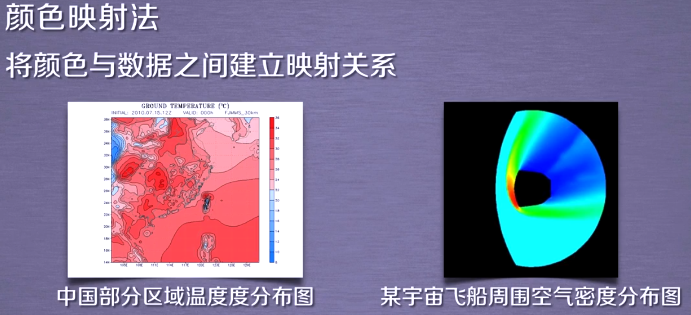
   2. 等值线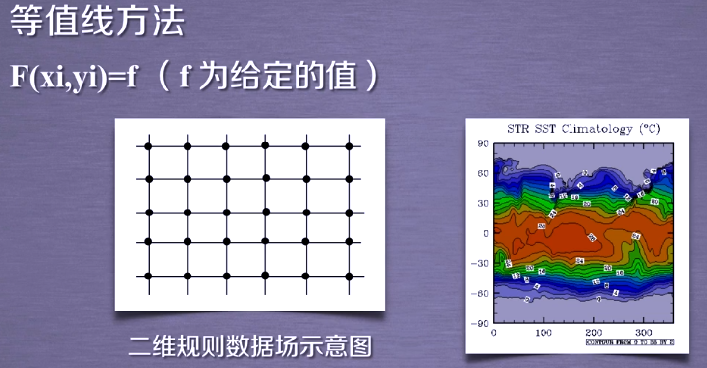  
   3. 立体图法和层次分割法——地理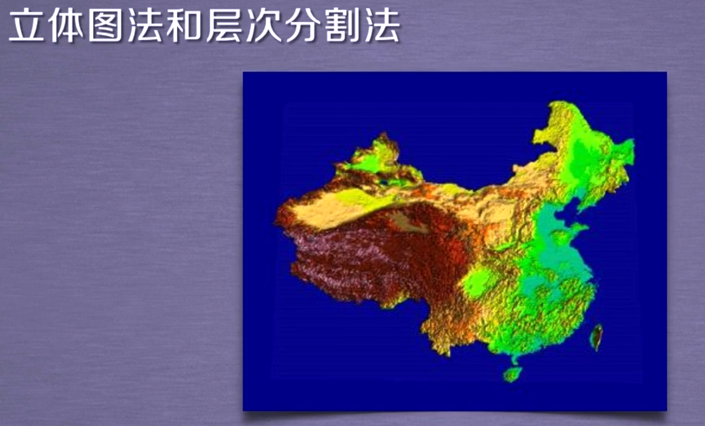  

2. 三维标量场
   1. 面绘制法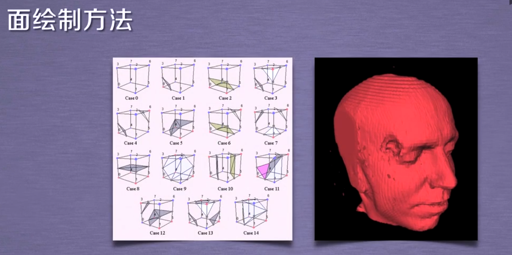  

   2. 体绘制法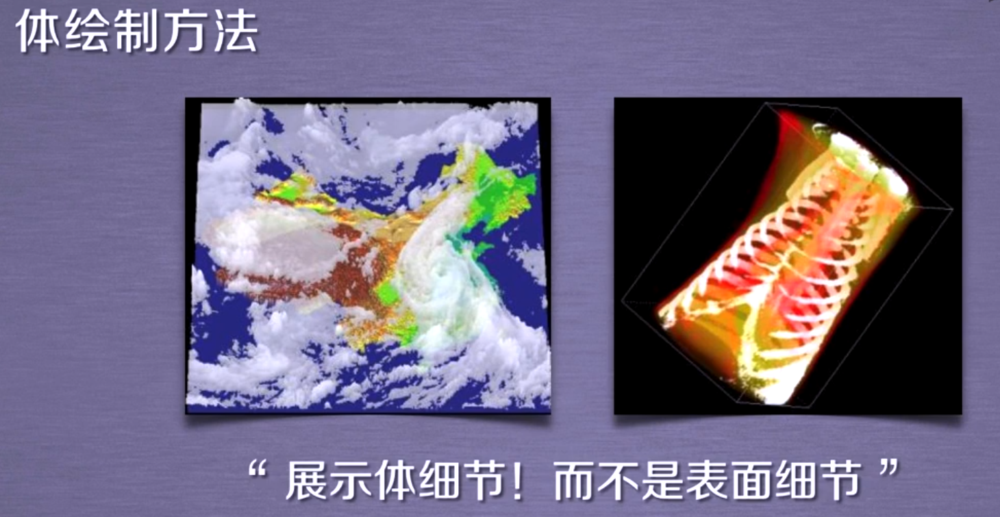  

3. 矢量场
   1. 矢量数据场流线法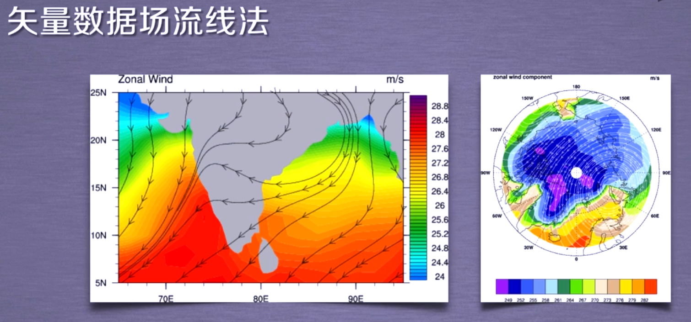
   2. 矢量数据场直接法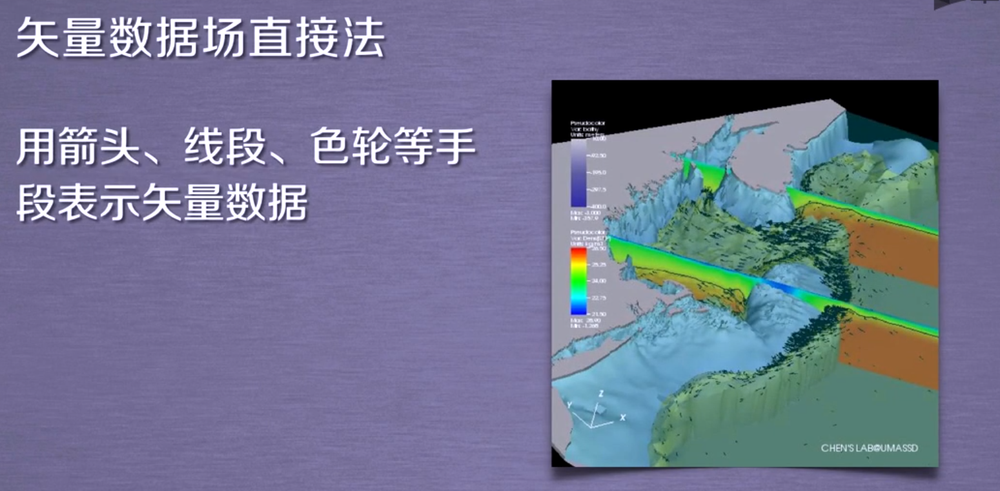  

## 2. TVTK安装

开源跨平台三维图形库，有国家实验室测试过
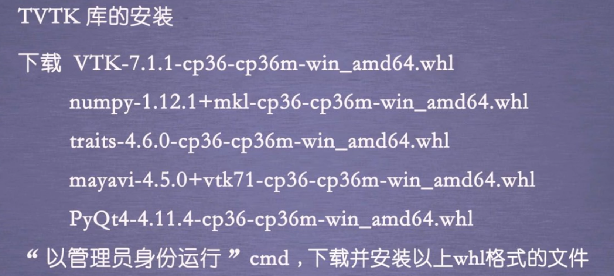  

打开文档帮助

```python
from tvtk.tools import tvtk_doc
tvtk_doc.main()
```

traits是TVTK的属性，相当于用traits封装

## 3. 三维基本对象

### 3.1 长方体对象

里面的值都可以查看
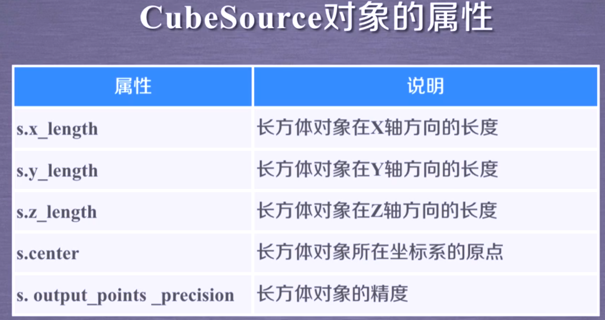  
更多细节看文档，以下是代码示例

```python
from tvtk.api import tvtk
#创建一个长方体数据源，并且同时设置其长寬高
s = tvtk. CubeSource(x_length=1.0, y_length=2.0, z_length=3.0)
#使用PolyDataMapper将数据转换为图形数据
m = tvtk.PolyDataMapper(input_connection=s.output_port)
#创建一个Actor
a = tvtk.Actor(mapper=m)
#创建一个渲染器，将Actor添加进去
r = tvtk.Renderer(background=(0, 0, 0))
r.add_actor(a)
#创建一个RenderWindow(绘制窗口)，将Renderer添加进去，窗口大小做参数
w = tvtk.RenderWindow(size=(500, 500))
w.add_renderer(r)
#创建一个RenderWindowInteractor (窗口的交互工具)
i = tvtk.RenderWindowInteractor(render_window= w )
#开启交互
i.initialize( )
i.start( )
```

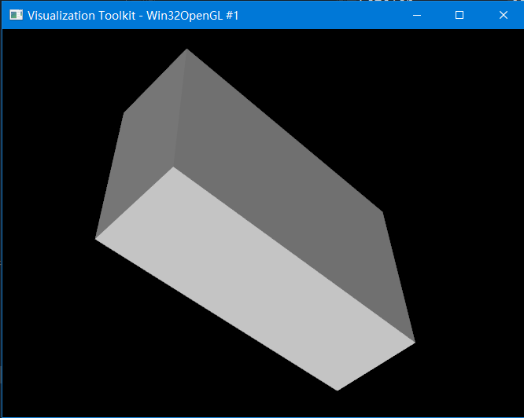  
左键旋转，右键放大或者缩小

### 3.2 其他

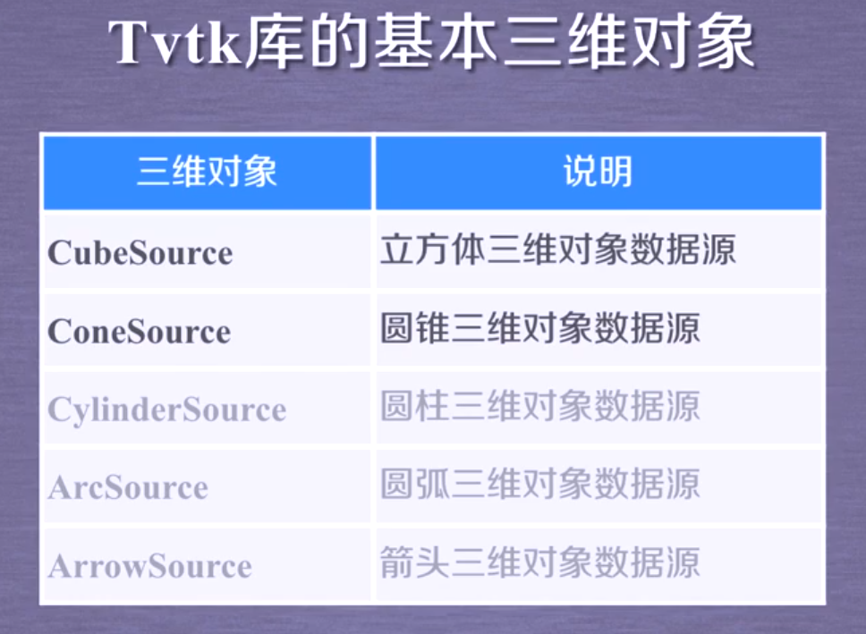  
还有很多

## 4 观察代码

```python
from tvtk.api import tvtk
def ivtk_scene(actors) :
    from tvtk. tools import ivtk
    #创建一个带Crust (Python Shell) 的窗口
    win = ivtk . IVTKWithCrustAndBrowser( )
    win.open()
    win.scene.add_actor(actors)
    #修正窗口错误
    dialog = win.control.centralWidget().widget(0).widget(0)
    from pyface.qt import QtCore
    dialog.setWindowFlags(QtCore.Qt.WindowFlags(0x00000000))
    dialog.show( )
    return win
def event_loop( ) :
    from pyface.api import GUI
    gui = GUI()
    gui.start_event_loop( )
s = tvtk.CubeSource(x_length=1.0, y_length=2.0,z_length=3.0)
m = tvtk.PolyDataMapper(input_connection=s.output_port)
a = tvtk.Actor(mapper=m)
win = ivtk_scene(a)
win.scene.isometric_view( )
event_loop( )
```

核心函数就是定义的哪两个，调用就是最后三行

```python
win = ivtk_scene(a)
win.scene.isometric_view( )
event_loop( )
```

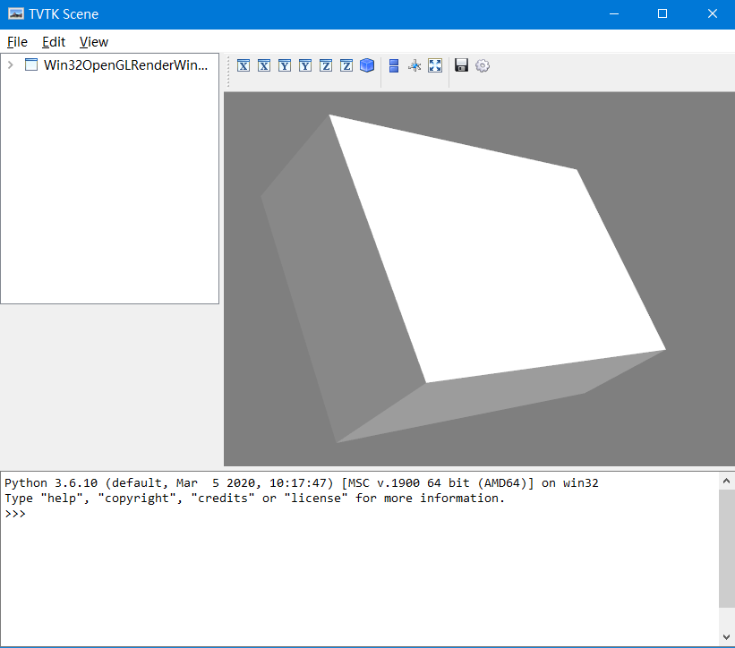  

## 5. 管线

管线技术，流水线技术，渲染引擎会提到
管线分类

1. 可视化管线
2. 图形管线

显示流程
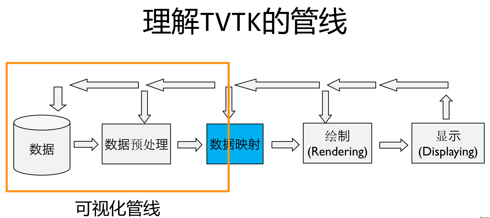  
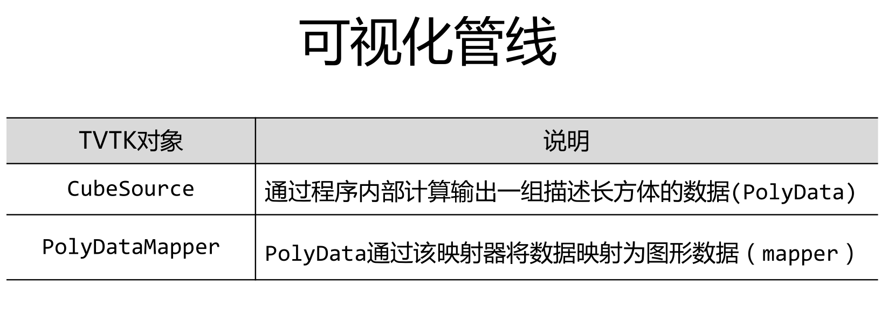  
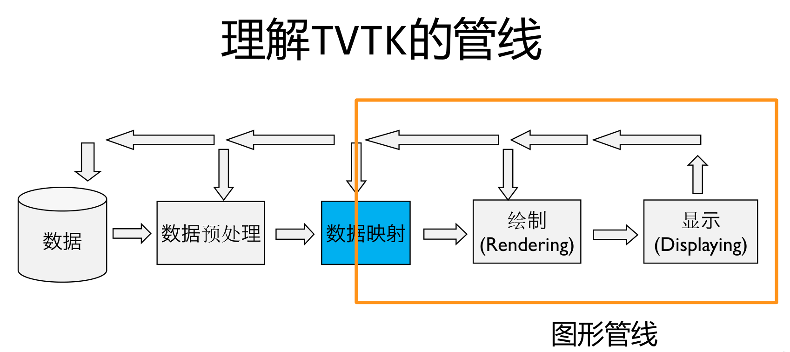  
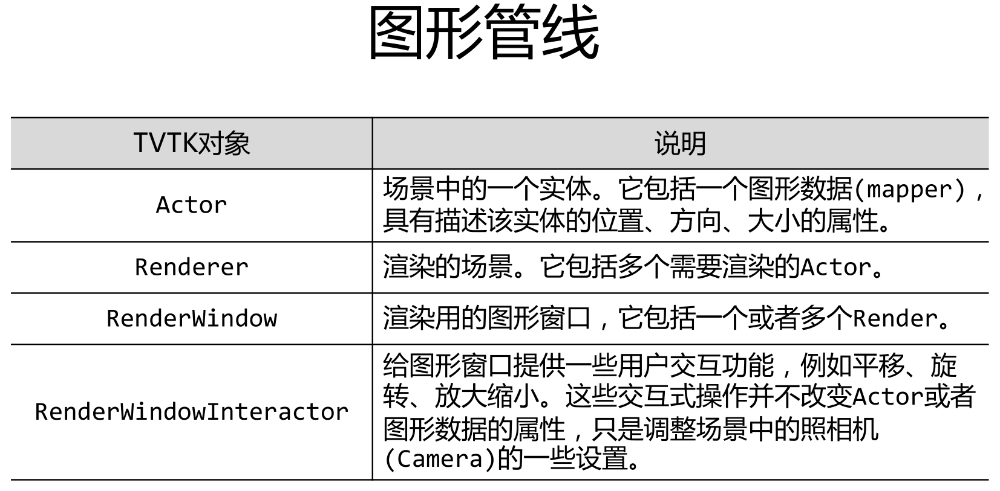  

## 6. 数据集-Imagedata

包含点和数据

* 点（Point）和数据（Data）
* 点之间：连接 or 非连接
* 多个相关的点组成单元（Cell）
* 点的连接：显式 or 隐式
* 数据：标量（Scalar）vs 矢量（Vector）

spacing：三维网格数据的起点坐标
origin：三维网格数据在X、Y、Z轴上的间距
dimensions：为在X、Y、Z轴上的网格数。
RectilinearGrid：间距不均匀的网格，所有点都在正交的网格上
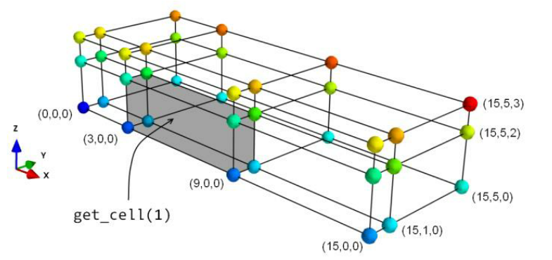  
StructuredGrid:创建任意形状的网格，需要指定点的坐标。
PolyData:由一系列的点、点之间的联系以及由点构成的多边形组成。
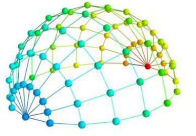  

常用函数

```python
from tvtk.api import tvtk
#规定数据集的属性
img =tvtk.ImageData(spacing=(1,1,1),origin=(1,2,3),dimensions=(3,4,5))
#得到数据集中点的坐标,number为第n-1个点
img.get_point(number)
#得到一个单位网格的元素
get_cell(number)
#RectilinearGrid
r = tvtk.RectilinearGrid()
r.x_coordinates = x
r.y_coordinates = y
r.z_coordinates = z
r.dimensions = len(x),len(y),len(z)
```

## 7. 数据加载

* 模型读取

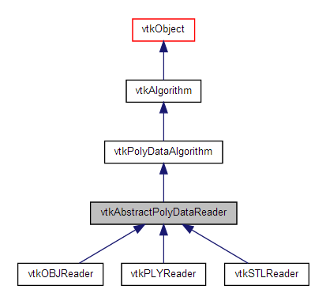  

```python
s = tvtk.STLReader(file_name = “stl文件名”)
m = tvtk.PolyDataMapper(input_connection = s.output_port)
a = tvtk.Actor(mapper=m)
```

Plot3D文件

* 网格 (XYZ 文件),
* 空气动力学结果 (Q 文件)
* 通用结果
multiBlock

```python
def read()
    Plot3d = tvtk.MultiBlockPL0T3DReader(
    xyz_file_name="combxyz.bin", #网格文件
    q_file_name="combq. bin",#空气动力学结果文件
    scalar_ function_ number=100, #设置标量数据数量
    vector_ function_ number=200 #设置矢量数据数量
    )
    Plot3d.update()
    return Plot3D
plot3d = read_data()
grid = plot3d.output.get_block(0)
```

## 8. 经典过程

### 8.1 模型创建

```python
from tvtk.api import tvtk
#创建一个长方体数据源，并且同时设置其长寬高
s = tvtk. CubeSource(x_length=1.0, y_length=2.0, z_length=3.0)
```

或者是打开数据源文件，见数据读取

### 8.2 数据预处理

```python
m = tvtk.PolyDataMapper(input_connection=s.output_port)
a = tvtk.Actor(mapper=m)
```

### 8.3 开启交互式界面

```python
win = ivtk_scene(a)
win.scene.isometric_view()
event_loop()
```

# 二、 高级运用
