<font face = "楷体" >

<!-- @import "[TOC]" {cmd="toc" depthFrom=1 depthTo=6 orderedList=false} -->

<!-- code_chunk_output -->
- [一、 TVTK库简要介绍](#一-tvtk库简要介绍)
  - [1. 目的：科学计算可视化](#1-目的科学计算可视化)
  - [2. TVTK安装](#2-tvtk安装)
  - [3. 三维基本对象](#3-三维基本对象)
    - [3.1 长方体对象](#31-长方体对象)
    - [3.2 其他](#32-其他)
  - [4. 观察代码](#4-观察代码)
  - [5. 管线](#5-管线)
  - [6. 数据集-Imagedata](#6-数据集-imagedata)
  - [7. 数据加载](#7-数据加载)
  - [8. 经典过程](#8-经典过程)
    - [8.1 模型创建](#81-模型创建)
    - [8.2 数据预处理](#82-数据预处理)
    - [8.3 开启交互式界面](#83-开启交互式界面)
- [二、 标量可视化](#二-标量可视化)
  - [1. 等值面](#1-等值面)
  - [2. 绘制等值面](#2-绘制等值面)
    - [设定N条等值线的值，一般用于重新绘制等值线](#设定n条等值线的值一般用于重新绘制等值线)
    - [设指定等值面和对应的等值面的值](#设指定等值面和对应的等值面的值)
- [三、 矢量数据可视化](#三-矢量数据可视化)
  - [1. 符号化技术](#1-符号化技术)
  - [2. 降采样](#2-降采样)
  - [3. 表示符号](#3-表示符号)
- [四、空间轮廓可视化](#四空间轮廓可视化)
  - [1. 外边框](#1-外边框)
    - [计算Polydata外边框](#计算polydata外边框)
  - [代码](#代码)
- [五、 Mayavi库](#五-mayavi库)
  - [1. 基本元素](#1-基本元素)
    - [1 . mlab](#1--mlab)
    - [2. API](#2-api)
    - [操作](#操作)
  - [2. 管线](#2-管线)
  - [3. 基于numpy的可视化](#3-基于numpy的可视化)
    - [3D绘图函数-Points3d()](#3d绘图函数-points3d)
    - [mayavi.mlab.show()](#mayavimlabshow)
    - [3D绘图函数-plot3d ()](#3d绘图函数-plot3d-)
    - [3D绘图函数-2D数据](#3d绘图函数-2d数据)
      - [imshow()](#imshow)
      - [surf()](#surf)
      - [contour_surf()](#contour_surf)
      - [mesh()](#mesh)
      - [barchart()](#barchart)
      - [triangular_mesh()](#triangular_mesh)
    - [3D绘图函数-3D数据](#3d绘图函数-3d数据)
      - [contour3d()](#contour3d)
      - [quiver3d()](#quiver3d)
      - [flow()](#flow)
    - [改变颜色](#改变颜色)
    - [图像控制函数](#图像控制函数)
    - [图像装饰函数](#图像装饰函数)
    - [相机控制函数](#相机控制函数)
    - [其他控制函数](#其他控制函数)
  - [鼠标选取](#鼠标选取)
  - [mlab管线控制函数](#mlab管线控制函数)
    - [Mlab管线控制函数的调用](#mlab管线控制函数的调用)

<!-- /code_chunk_output -->

# 一、 TVTK库简要介绍

## 1. 目的：科学计算可视化

1. 二维标量场
   1. 颜色映射法 1](images/8c002b36235cffb9285b2557c91afa44340a9560cda43189bd41a0ec05a308b1.png)  
   2. 等值线  1](images/9a5d9f2aedb8f329bcdce243b41134ee2651c51f0dada829f85a5fab68114729.png)
   3. 立体图法和层次分割法——地理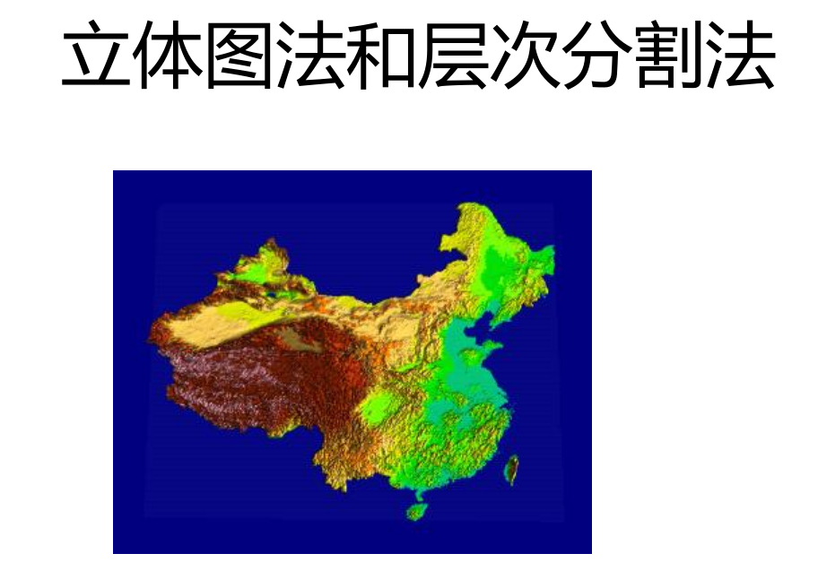  
2. 三维标量场
   1. 面绘制法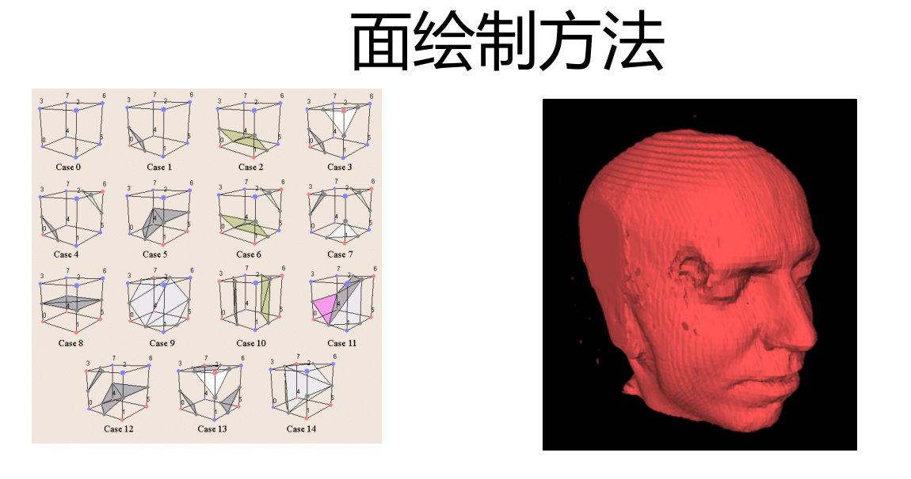  
   2. 体绘制法 1](images/3a5a649d42a28cbabe99c5fa66b9c874abada567ff785f9398076cc32b0de422.png)  
3. 矢量场
   1. 矢量数据场流线法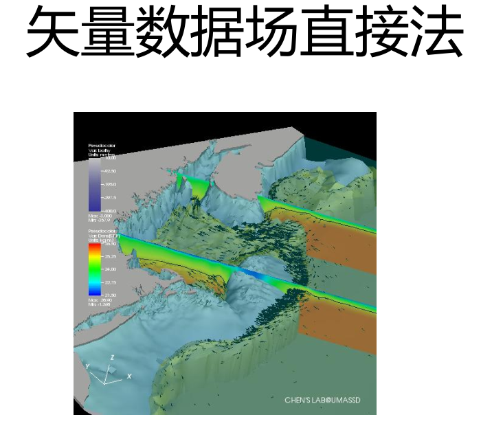  

   2. 矢量数据场直接法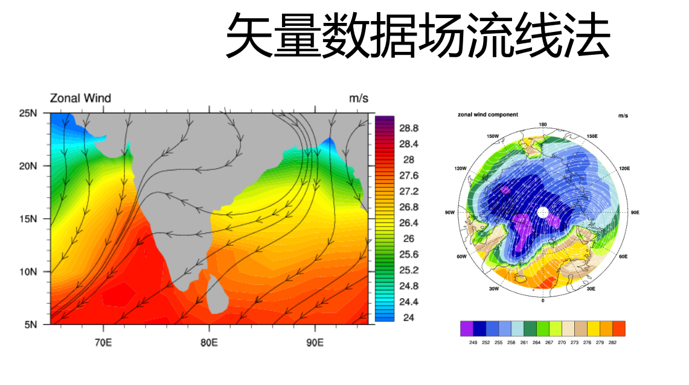  

## 2. TVTK安装

开源跨平台三维图形库，有国家实验室测试过
  

打开文档帮助

```python
from tvtk.tools import tvtk_doc
tvtk_doc.main()
```

traits是TVTK的属性，相当于用traits封装

## 3. 三维基本对象

### 3.1 长方体对象

里面的值都可以查看
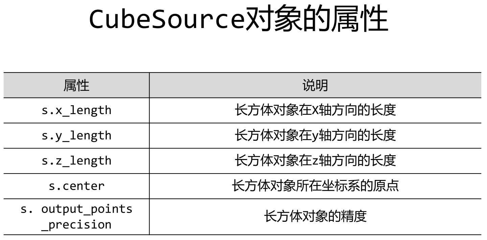  
更多细节看文档，以下是代码示例

```python
from tvtk.api import tvtk
#创建一个长方体数据源，并且同时设置其长寬高
s = tvtk. CubeSource(x_length=1.0, y_length=2.0, z_length=3.0)
#使用PolyDataMapper将数据转换为图形数据
m = tvtk.PolyDataMapper(input_connection=s.output_port)
#创建一个Actor
a = tvtk.Actor(mapper=m)
#创建一个渲染器，将Actor添加进去
r = tvtk.Renderer(background=(0, 0, 0))
r.add_actor(a)
#创建一个RenderWindow(绘制窗口)，将Renderer添加进去，窗口大小做参数
w = tvtk.RenderWindow(size=(500, 500))
w.add_renderer(r)
#创建一个RenderWindowInteractor (窗口的交互工具)
i = tvtk.RenderWindowInteractor(render_window= w )
#开启交互
i.initialize( )
i.start( )
```

  1](images/9e262439297cdc687bdae5594adc7e3decec098fd918c164baae6a528058a101.png)  
左键旋转，右键放大或者缩小

### 3.2 其他

   1](images/f72e416921d8ee94ff712420fc8ec553b450f5e5823784902ee1abdfdfd59ed9.png)  

还有很多

## 4. 观察代码

```python
from tvtk.api import tvtk
def ivtk_scene(actors) :
    from tvtk. tools import ivtk
    #创建一个带Crust (Python Shell) 的窗口
    win = ivtk . IVTKWithCrustAndBrowser( )
    win.open()
    win.scene.add_actor(actors)
    #修正窗口错误
    dialog = win.control.centralWidget().widget(0).widget(0)
    from pyface.qt import QtCore
    dialog.setWindowFlags(QtCore.Qt.WindowFlags(0x00000000))
    dialog.show( )
    return win
def event_loop( ) :
    from pyface.api import GUI
    gui = GUI()
    gui.start_event_loop( )
s = tvtk.CubeSource(x_length=1.0, y_length=2.0,z_length=3.0)
m = tvtk.PolyDataMapper(input_connection=s.output_port)
a = tvtk.Actor(mapper=m)
win = ivtk_scene(a)
win.scene.isometric_view( )
event_loop( )
```

核心函数就是定义的哪两个，调用就是最后三行

```python
win = ivtk_scene(a)
win.scene.isometric_view( )
event_loop( )
```

## 5. 管线

管线技术，流水线技术，渲染引擎会提到
管线分类

1. 可视化管线
2. 图形管线

显示流程
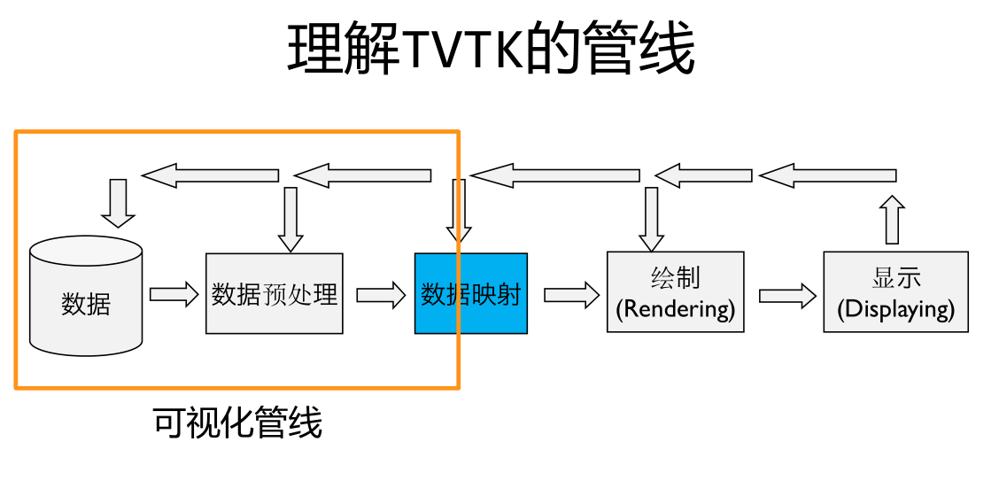  
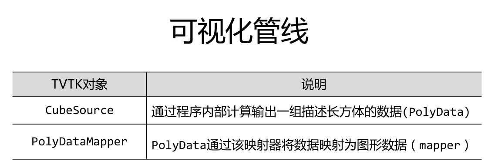  
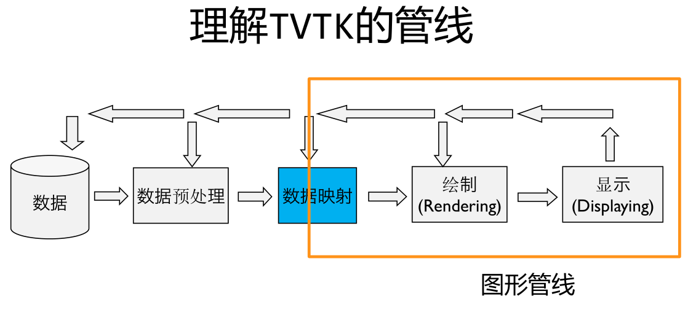  
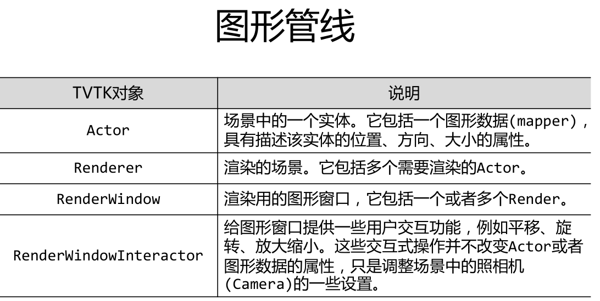  

## 6. 数据集-Imagedata

包含点和数据

- 点（Point）和数据（Data）
- 点之间：连接 or 非连接
- 多个相关的点组成单元（Cell）
- 点的连接：显式 or 隐式
- 数据：标量（Scalar）vs 矢量（Vector）

spacing：三维网格数据的起点坐标
origin：三维网格数据在X、Y、Z轴上的间距
dimensions：为在X、Y、Z轴上的网格数。
RectilinearGrid：间距不均匀的网格，所有点都在正交的网格上
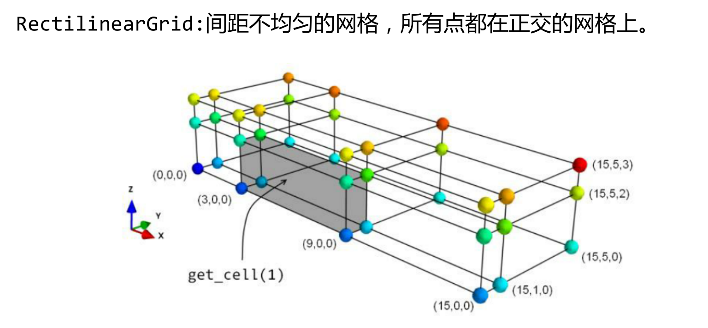  

StructuredGrid:创建任意形状的网格，需要指定点的坐标。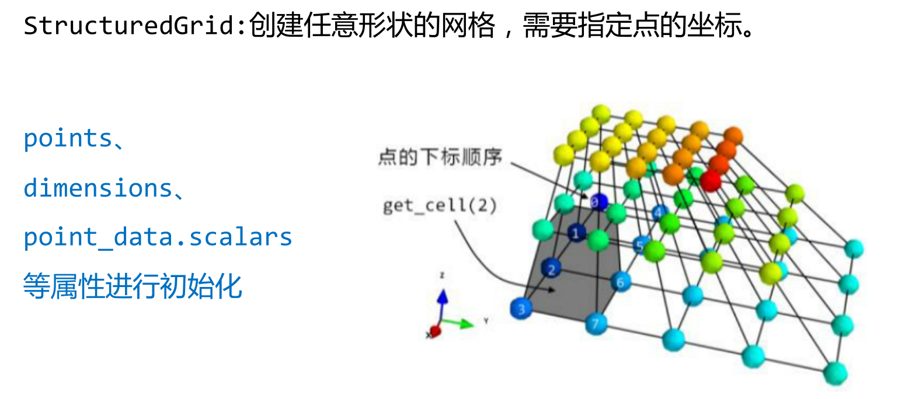  

PolyData:由一系列的点、点之间的联系以及由点构成的多边形组成。
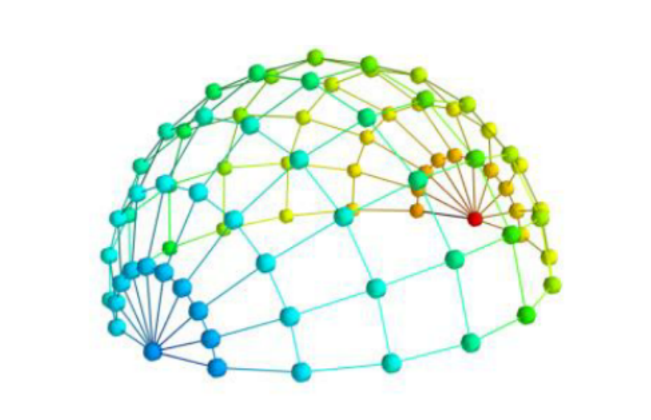  
  
常用函数

```python
from tvtk.api import tvtk
#规定数据集的属性
img =tvtk.ImageData(spacing=(1,1,1),origin=(1,2,3),dimensions=(3,4,5))
#得到数据集中点的坐标,number为第n-1个点
img.get_point(number)
#得到一个单位网格的元素
get_cell(number)
#RectilinearGrid
r = tvtk.RectilinearGrid()
r.x_coordinates = x
r.y_coordinates = y
r.z_coordinates = z
r.dimensions = len(x),len(y),len(z)
```

## 7. 数据加载

- 模型读取

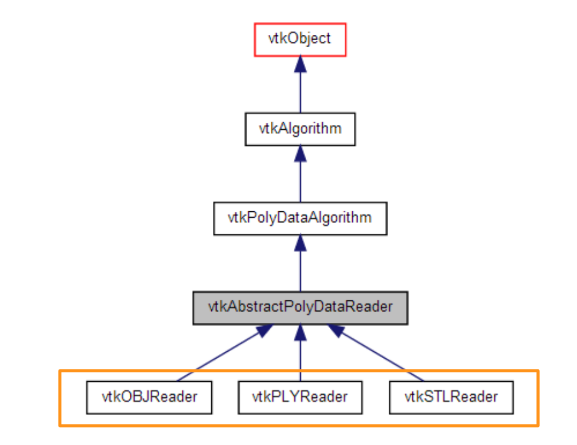  

```python
s = tvtk.STLReader(file_name = “stl文件名”)
m = tvtk.PolyDataMapper(input_connection = s.output_port)
a = tvtk.Actor(mapper=m)
```

Plot3D文件

- 网格 (XYZ 文件),
- 空气动力学结果 (Q 文件)
- 通用结果
multiBlock

```python
def read()
    Plot3d = tvtk.MultiBlockPL0T3DReader(
    xyz_file_name="combxyz.bin", #网格文件
    q_file_name="combq. bin",#空气动力学结果文件
    scalar_ function_ number=100, #设置标量数据数量
    vector_ function_ number=200 #设置矢量数据数量
    )
    Plot3d.update()
    return Plot3D
plot3d = read_data()
grid = plot3d.output.get_block(0)
```

## 8. 经典过程

### 8.1 模型创建

```python
from tvtk.api import tvtk
#创建一个长方体数据源，并且同时设置其长寬高
s = tvtk. CubeSource(x_length=1.0, y_length=2.0, z_length=3.0)
```

或者是打开数据源文件，见数据读取

### 8.2 数据预处理

```python
m = tvtk.PolyDataMapper(input_connection=s.output_port)
a = tvtk.Actor(mapper=m)
```

### 8.3 开启交互式界面

```python
win = ivtk_scene(a)
win.scene.isometric_view()
event_loop()
```

# 二、 标量可视化

## 1. 等值面

等值面过滤器
tvtk.ContourFilter()

## 2. 绘制等值面

### 设定N条等值线的值，一般用于重新绘制等值线

generate_values(n, grid.point_data.scalars.range)

### 设指定等值面和对应的等值面的值

set_value(0,0.3)

```python
from tvtk.api import tvtk
from tvtkfunc import ivtk_ scene
p1ot3d = tvtk.MultiB1ockPL0T3DReader(
              xyz_file_name= "combxyz.bin" ,
              q_file_name="combq . bin",
              scalar_function_number=100,
              vector_function_number=200
              )#读入P1ot3D数据
plot3d.update()#让p1ot3D计算其输出数据
grid = p1ot3d.output.get_block(0)#获取读入的数据集对象

con = tvtk.ContourFilter()#创建等值面对象
con.set_input_data(grid)
#创建10个等值面，指定轮廓数和数据范围
#这个地方的10会让图像更多彩
con.generate_values(10, grid.point_data.scalars .range)
#设定映射器的变量范围属性，最小值红色，最大值蓝色
m =tvtk.PolyDataMapper(scalar_range = grid.point_data.scalars.range,
input_connection=con.output_port )
a = tvtk.Actor(mapper = m)
a.property.opacity = 0.5#设定透明度为0.5
#窗口绘制
win = ivtk_scene(a)

```

# 三、 矢量数据可视化

## 1. 符号化技术

tvtk.Glyph3D()   放缩，着色

- scale_factor符号的共同放缩器

- input_connection=mask.output_port

## 2. 降采样

tvtk.MaskPoints(random_mode=True, on_ratio)

- random_mode:随机选取
- on_ratio:每几个点选取一个

## 3. 表示符号

glyph_source = tvtk.ArrowSource( )
修改为tvtk.ConeSource( )
scale_factor = 2

```python
from tvtk.api import tvtk
from tvtkfunc import ivtk_ scene
#读入数据
p1ot3d = tvtk.MultiB1ockPL0T3DReader(
              xyz_file_name= "combxyz.bin" ,
              q_file_name="combq.bin",
              scalar_function_number=100,
              vector_function_number=200
              )#读入P1ot3D数据
plot3d.update()#让p1ot3D计算其输出数据
grid = p1ot3d.output.get_block(0)#获取读入的数据集对象
#对数据集中的数据进行随机选取，每50个 点选择一个点
mask = tvtk.MaskPoints(random_mode=True, on_ratio=50)
#每50个点选取一个点
mask.set_input_data(grid)
#创建表示箭头的PolyData数据集
glyph_source = tvtk.ArrowSource( )
#在Mask采样后的PolyData数据集每个点上放置一个箭头
#箭头的方向、长度和颜色由于点对应的矢量和标量数据决定
glyph = tvtk.Glyph3D(input_connection=mask.output_port,scale_factor=4)

glyph.set_source_.connection(g1yph_source.output_port)
m = tvtk.PolyDataMapper(scalar_range=grid. point_data.scalars.range,
input_ .connection=glyph.output_port)
a = tvtk.Actor(mapper=m)
#窗口绘制

```

# 四、空间轮廓可视化

## 1. 外边框

### 计算Polydata外边框

tvtk.StructuredGridOutlineFilter()

## 代码

```python
from tvtk.api import tvtk
from tvtk.common import configure_input
from tvtkfunc import ivtk_ scene, event_ _1oop
p1ot3d = tvtk . MultiB1ockPL0T3DReader(
xyz_ file_ name= "combxyz.bin",
q_ _file_ name="combq . bin"
scalar_ function_ number=100， vector_ function_ number=200
)#读入P1ot3D数据
plot3d.update()#让p1ot3D计算其输出数据
grid = plot3d.output.get_block(0)#获取读入的 数据集对象
outline = tvtk.StructuredGridoutlineFilter( )#计算表示外边框的PolyData对象
configure_input(outline, grid)# 调用tvtk.common.configure_input( )
m = tvtk.PolyDataMapper(input_connection=outline.output_port )
a = tvtk.Actor(mapper=m)
a. property.color = 0.3, 0.3, 0.3
#窗口绘制
win = ivtk_scene(a)
win.scene.isometric_view( )
event_loop( )

```

# 五、 Mayavi库

## 1. 基本元素

### 1 . mlab

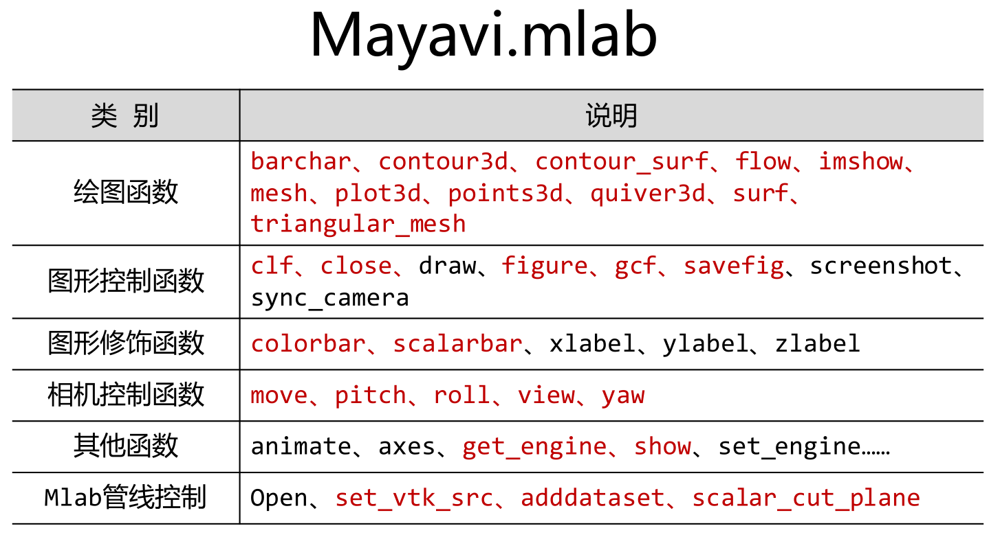  

mlab.mesh(x,y,z)

- shift+鼠标左键拖动
- ctrl+左键旋转视角
  
### 2. API

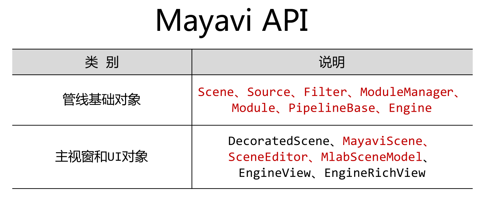  

### 操作

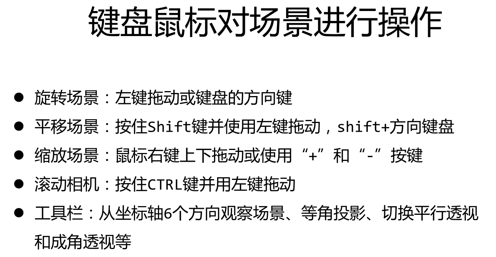  

## 2. 管线

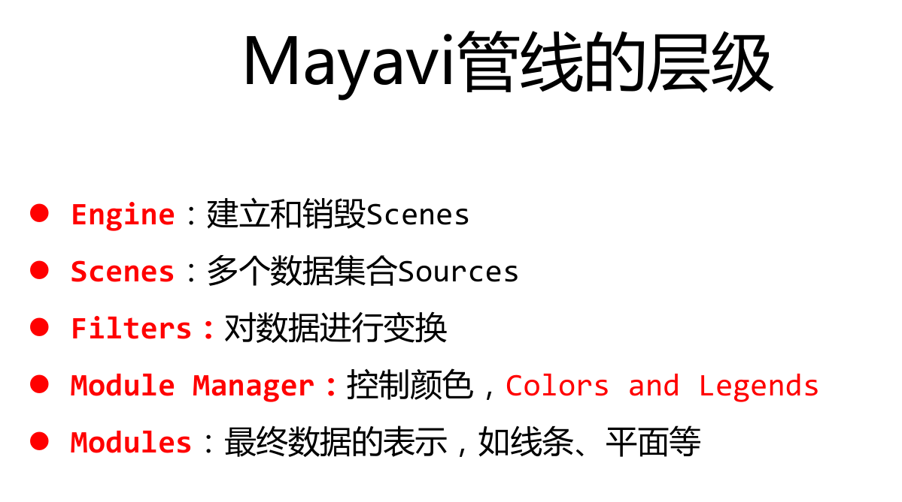  

打开管线对话框
mlab.show_pipeline()

## 3. 基于numpy的可视化

### 3D绘图函数-Points3d()

- 函数形式：
  points3d(x, y, z…)
  points3d(x, y, z, s, …)
  points3d(x, y, z, f, …)
  x,y,z表示numpy数组、列表或者其他形式的点三维坐标，s表示在该坐标点处的标量值，f表示通过函数f（x，y，z）返回的标量值
- color：VTK对象的颜色，定义为(0,1)的三元组
- colormap：colormap的类型，例如Reds、Blues、Copper等,改颜色的
- extent：x、y、z数组范围[xmin, xmax, ymin, ymax, zmin, zmax]
- figure：画图
- line_width：线的宽度，该值为float，默认为0.2
- mask_points：减少/降低大规模点数据集的数量
mode：符号的模式，例如2darrow、2dcircle、arrow、cone等
- name：VTK对象名字
- opcity：Vtk对象的整体透明度，该值为float型，默认为1.0
- reset_zoom：对新加入场景数据的放缩进行重置。默认为True
- resolution：符号的分辨率，如球体的细分数，该值为整型，默认为8
- scale_factor：符号放缩的比例
- scale_mode：符号的放缩模式，如vector、scalar、none
- transparent：根据标量值确定actor的透明度
- vmax：对colormap放缩的最大值
- vmin：对colormap放缩的最小值

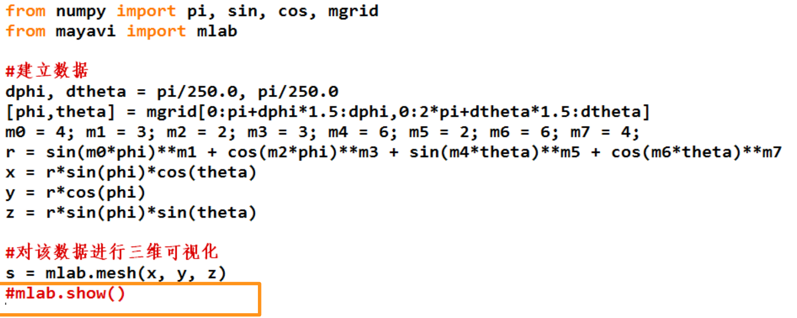  

```python
import numpy as np
from mayavi import mlab
#建立数据
t = np.linspace(0, 4 * np.pi, 20)
x = np.sin(2 * t)
y = np.cos(t)
z = np.cos(2 * t)
s = 2+ np.sin(t)
#对数据进行可视化
points = mlab.points3d(x, y, z, s,colormap="Reds",scale_factor=.25)
mlab.show()

```

### mayavi.mlab.show()

mayavi.mlab.show(func = None, stop = False)
定义GUI时间对话框是否结束

### 3D绘图函数-plot3d ()

- 函数形式：
  plot3d(x, y, z…)
  plot3d(x, y, z, s, …)
  x,y,z表示numpy数组，或列表。给出了线上连续的点的位置，s表示在该坐标点处的标量值
- color、colormap、extent、figure、line_width、name、opacity、representation、reset_zoom、transparent、tube_radius、tube_sides、vmax、vmin
- 参数 说明
  tube_radius 线管的半径，用于描述线的粗细
  tube_sides 表示线的分段数，该值为整数，默认为6

```python
import numpy as np
from mayavi import mlab
#建立数据
n_mer，n_long =6，11
dphi = np.pi / 1000.0
phi = np.arange(0.0，2 * np.pi + 0.5 * dphi, dphi)
mu=phi*n_mer
x = np.cos(mu) * (1 + np.cos(n_long * mu / n_ mer)
* 0.5)
y = np.sin(mu) * (1 + np.cos(n_long * mu / n_ mer) * 0.5)
z=np.sin(n_1ong*mu/n_mer)*0.5
#对数据进行可视化
l = mlab.p1ot3d(x,y,z,np.sin(mu), tube_radius=0.025，colormap= 'Spectral')
mlab.show( )
```

plot3d(x, y, z, np.sin(mu), tube_radius=0.025,
colormap=‘Spectral’)
x,y,z表示numpy数组，给出了线上连续的点的位置,np.sin(mu)表示在该坐标点处的标量值,tube_radius绘制线的半径为0.025,colormap采用Spectral颜色模式。

### 3D绘图函数-2D数据

#### imshow()

将二维数组可视化为一张图像
函数形式：
  imshow(s, …)
  s是一个二维数组,s的值使用colormap被映射为颜*

- color、colormap、extent、figure、interpolate、line_width、name、opacity、reset_zoom、transparent、vmax、vmin

- interpolate：图像中的像素是否被插值，该值为布尔型，默认为True

#### surf()

将二维数组可视化为一个平面，Z轴描述了数组点的高度

- 函数形式
  surf(s, …)
  surf(x, y, s,…)
  surf(x, y, f,…)
  s是一个高程矩阵，用二维数组表示

```python
import numpy as np
from mayavi import mlab
def f(x, y):
  return np.sin(x - y)+np.cos(x + y)
x，y = np.mgrid[-7. :7.05:0.1， -5. :5.05:0.05]
S = m1ab.surf(x, y, f )
mlab.show( )
```

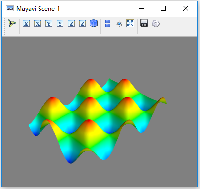  

#### contour_surf()

将二位数组可视化为等高线，高度值由数组点的值来确定,与Surf()类似，但求解的是等值线

```python
import numpy as np
from mayavi import mlab
def f(x, y):
  return np.sin(x - y)+np.cos(x + y)
x，y = np.mgrid[-7. :7.05:0.1， -5. :5.05:0.05]
S = mlab.contour_surf(x, y, f )
mlab.show( )
```

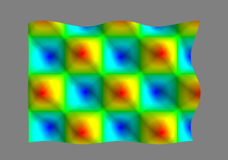  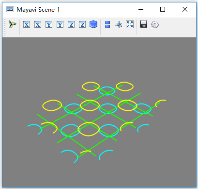  

#### mesh()

绘制由三个二维数组x、y、z描述坐标点的网格平面

#### barchart()

根据二维、三维或者点云数据绘制的三维柱状图

#### triangular_mesh()

绘制由x、y、z坐标点描述的三角网格面

### 3D绘图函数-3D数据

#### contour3d()

三维数组定义的体数据的等值面可视化,
函数形式：

- contour3d(scalars, …)
- contour3d(x, y, z，scalars,…)
- scalars网格上的数据，用三维numpy数组表示。x，y，z三维空间坐标
- contours 定义等值面的数量

```python
import numpy as np
from mayavi import mlab
x, y, Z = np.ogrid[-5:5:64j， -5:5:64j, -5:5:64j ]
scalars = X*x+y*y+Z* z
obj = mlab. contour3d(scalars，contours=8， transparent=True )#透明表示
mlab.show()
```

#### quiver3d()

三维矢量数据的可视化，箭头表示在该点的矢量数据

- 函数形式：
  - quiver3d(u，v，w …)
  - quiver3d(x，y，z，u，v，w …)
  - quiver3d(x，y，z，f，…)
  - u，v，w用numpy数组表示的向量，x，y，z表示箭头的位置， u，v，w矢量元素，f需要返回在给定位置（x，y，z）的（u，v，w）矢量

```python
import numpy as np
from mayavi import mlab
x, y,z = np.mgrid[-2:3, -2:3, -2:3]
r = np.sqrt(x**2+y**2+z**4)
u= y * np.sin(r) / (r + 0.001)
V=-x*np.sin(r)/(r+0.001)
W = np.zeros_like(z)
obj = mlab.quiver3d(x, y, z, u, V, W, line_width=3, scale_ factor=1)
mlab.show( )
```

#### flow()

绘制3维数组描述的向量场的粒子轨迹

### 改变颜色

常见的colormaps
=accent flag hot pubu set2
autumn gist_earth hsv pubugn set3
black-white gist_gray jet puor spectral
blue-red gist_heat oranges purd spring
blues gist_ncar orrd purples summer
bone gist_rainbow paired rdbu winter
brbg gist_stern pastel1 rdgy ylgnbu
bugn gist_yarg pastel2 rdpu ylgn
bupu gnbu pink rdylbu ylorbr
cool gray piyg rdylgn ylorrd
copper greens prgn reds
dark2 greys prism setl

lut

### 图像控制函数

- clf 清空当前图像 mlab.clf(figure=None)
- close 关闭图像窗口 mlab.close(scene=None, all=False)
- draw 重新绘制当前图像mlab.close(figure=None)
- figure：建立一个新的Scene或者访问一个存在的Scene
mlab.figure(figure=None,bgcolor=None,fgcolor=None,
engine=None,size=(400,350))
- gcf 返回当前图像的handle mlab.gc(figure=None)
- savefig 存储当前的前景，输出为一个文件，如png、jpg、bmp、tiff、pdf、obj、vrml等

### 图像装饰函数

- cololorbar 为对象的颜色映射增加颜色条
mlab.clolorbar(object=None, title=None, orientation=None, nb_labels=None, nb_colors=None, label_fmt=None)
- scalarbar 为对象的标量颜色映射增加颜色条
- vectorbar 为对象的矢量颜色映射增加颜色条
- xlabel 建立坐标轴，并添加x轴的标签  
  mlab.xlabel(text, object=None)
- ylabel 建立坐标轴，并添加y轴的标签
- zlabel 建立坐标轴，并添加z轴的标签

### 相机控制函数

- move 移动相机和焦点
mlab.move(forward=None, right=None, up=None)
- pitch 沿着“向右”轴旋转角度mlab.pitch(degrees)
- roll 设置/获取相机沿“向前”轴旋转一定角度
mlab.roll(roll=None, figure=None)
- view 设置/获取当前视图中相机的视点
mlab.view(azimuth=None, elevation=None, distance=None, focalpoint=None, roll=None, reset_roll=True, figure=None)
- yaw 沿着“向上”轴旋转一定角度，
  mlab.yaw(degrees)

### 其他控制函数

- animate动画控制函数
mlab.animate(func=None, delay=500, ui=True)
axes 为当前物体设置坐标轴 mlab.axes(*args, **kwargs)
- outline 为当前物体建立外轮廓
  mlab.outline(*args, **kwargs)
- show 与当前图像开始交互 mlab.show(func=None, stop=False)
- show_pipeline 显示mayavi的管线对话框，可一进行场景属性的设置和编辑
- text 为图像添加文本mlab.text(*args, **kwargs)
- title 为绘制图像建立标题 mlab.title(*args, **kwargs)

## 鼠标选取

- 选取一个物体，查看数据
- 选取物体上一点，查看数据

鼠标选取
on_mouse_pick(callback, type=‘point’,Button=‘Left’,Remove=False)

- Type:’point’,’cell’or ‘world’
- Button:’Left’,’Middle’or ‘Right’
- Remove:如果值为True，则callback函数不起作用
- 返回：一个vtk picker 对象

```python

```

## mlab管线控制函数

### Mlab管线控制函数的调用

- mlab.pipeline.function()
- Sources：数据源
- Filters：用来数据变换
- Modules：用来实现可视化

Sources

- grid_source 建立二维网格数据
- line_source 建立线数据
- open 打开一个数据文件
- scalar_field 建立标量场数据
- vector_field 建立矢量场数据
- volume_filed 建立体数据

Filters---32个

- contour 对输入数据集计算等值面
- cut_plane 对数据进行切面计算，可以交互的更改和移动切面
- delaunay2D 执行二维delaunay三角化
- delaunay3D 执行三维delaunay三角化
- extract_grid 允许用户选择structured grid的一部分数据
- extract_vector_norm 计算数据矢量的法向量，特别用于在计算矢量数据的梯度时
- mask_points 对输入数据进行采样
- threshold 取一定阈值范围内的数据
- transform_data 对输入数据执行线性变换
- tube 将线转成管线数据
  
Module 23个

- axes 绘制坐标轴
- glyph对输入点绘制不同类型的符号，符号的颜色和方向由该点的标量和适量数据决定。
- image_plane_widget 绘制某一平面数据的细节
- iso_surface 对输入的体数据绘制其等值面
- outline 对输入数据绘制外轮廓
- scalar_cut_plane 对输入的标量数据绘制特定位置的切平面
- streamline 对矢量数据绘制流线
- surface 对数据（VTK dataset，mayavi sources）建立外表面
- text 绘制一段文本
- vector_cut_plane 对输入的矢量数据绘制特定位置的切平面
- volume 对标量场数据进行体绘制

可参考官方网站<http://docs.enthought.com/mayavi/mayavi/auto/mlab_reference.html>


