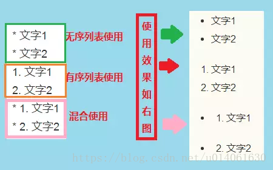
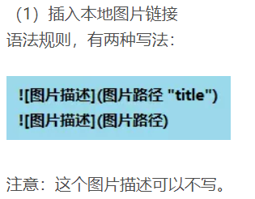
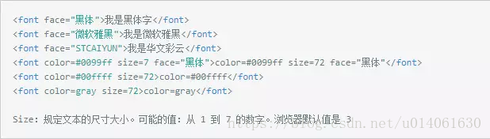

<font face="宋体">
进入文章前，现在命令行中输入，然后ctrl+s即可自动创建目录
```none
Markdown Preview Enhanced: Create Toc
```
<!-- @import "[TOC]" {cmd="toc" depthFrom=1 depthTo=6 orderedList=false} -->

<!-- code_chunk_output -->

- [这是我的第一篇文章](#这是我的第一篇文章)
  - [这是二级标题](#这是二级标题)
    - [三级标题](#三级标题)
  - [编号](#编号)
  - [处理字体](#处理字体)
  - [插入图片](#插入图片)
  - [公式编辑器latex](#公式编辑器latex)
  - [表格](#表格)
  - [链接](#链接)
  - [code](#code)
  - [导出PDF](#导出pdf)

<!-- /code_chunk_output -->


# 这是我的第一篇文章

## 这是二级标题

这是正文哈哈哈哈。换了一行？你弟弟队服撒地方是大声道水电费阿萨是否是萨芬的阿斯蒂芬是否阿斯蒂芬啥打法上地方撒地方阿斯顿发大水发发顺丰撒旦法水电费阿斯蒂芬水电费adf dfa

### 三级标题

直接写就是这正文的发。写的
的发大大的的的

## 编号

1. 自动编号
1. 自动的
    1. d
    2. df

df d

1. df df



## 处理字体

**加粗**
*变斜*
  

<font face ="楷体">

段落换行需要空行

可以

## 插入图片

复制图片Ctrl alt V

加图片



## 公式编辑器latex

公式
$$
\lim_{x \to \infin}\frac{(sin(t))}{x}=1
$$

也可以在文字中插入公式 $\lim_{x \to \infin}\frac{(sin(t))}{x}=1$ 好好

## 表格

  |--:|冒号在哪边是什么对齐

| 小明 | g   | g   |
| ---- | --- | --- |
| 1.5  | 1.4 | 2.3 |
| 2    | 2   | 3   |
alt +shift +f 表格格式一下

## 链接

直接cv就行

## code

这个地方告诉你是什么语言
代码块用```包起来，第一个后告诉语言类型

```python

import os
print("wen")

```

markdown

## 导出PDF

从chrome选PDF，导出就行  



试一试效果还行

  
右键粘贴图片就可以了贴上去了

def pie_draw(num,row):
  pie_1= sheet3.col_values(row)[1:-3]
  bin = np.bincount(pie_1)
  #t = [6,9,10,12]
  loc = int(qm_meangrades[row])+1
  bins = np.zero(len(bin)-loc)
  bins[0] = sum(bin[0:loc])
  bins[1:-1] = bin[loc+1:-1]
  label = np.arange(loc-1,max(pie_1),1)